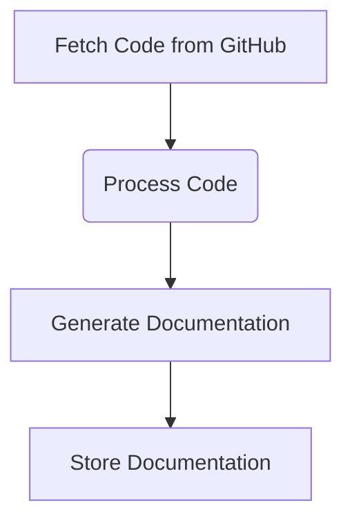

## 🎯 Overall Project Purpose
The project aims to analyze a multi-language codebase along with existing documentation to generate comprehensive documentation in Markdown format. It involves fetching code from various programming languages, processing it, and creating structured documentation.

## 🧩 Module-Level Summaries
- **index.html**: Contains the HTML structure for the project's main page.
- **tailwind.config.js**: Configures Tailwind CSS settings for the project.
- **vite.config.js**: Configures Vite build tool settings for the project.
- **postcss.config.js**: Configures PostCSS plugins for the project.
- **app.py**: Python script for generating comprehensive documentation from codebase.
- **activate_venv.py**: Python script to activate a virtual environment.
- **main.py**: FastAPI script for interacting with GitHub repositories and generating documentation.
- **index.css**: CSS file for styling the project.
- **classNames.js**: Utility function for joining CSS class names.
- **supabase.js**: JavaScript file for interacting with Supabase database.

## 🧠 Code Logic and Workflows
The project involves fetching code from various programming languages, processing it, and generating comprehensive documentation. It interacts with external services like GitHub, Google AI, and Supabase for different functionalities.

### Workflow Diagram

## 🗂️ Architecture Diagram
The architecture involves frontend (HTML, CSS), backend (Python FastAPI), and data storage (Supabase). The frontend interacts with the backend to generate documentation from codebase.

## 🧬 Service/API Dependency Diagrams
- **GitHub API**: Used to fetch code from repositories.
- **Google AI**: Used for content generation.
- **Supabase API**: Used for data storage.

## 🛠️ Database ER Diagrams
N/A (No explicit schema or ORM found in the provided codebase).

## 💡 Best Practices & Improvement Suggestions
- Implement error handling for API interactions to handle failures gracefully.
- Use environment variables for sensitive information like API keys.
- Add unit tests to ensure code reliability.
- Consider adding more detailed comments and documentation within the codebase for better understanding.