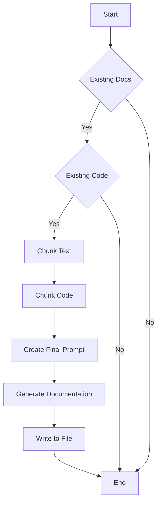

## 🎯 Overall Project Purpose
The project aims to generate comprehensive documentation for a multi-language codebase by analyzing existing code and documentation. It utilizes AI-powered tools to create detailed markdown documentation that includes file/module details, key functions/components, implementation details, and visual diagrams.

## 🧩 Module-Level Summaries
### `index.html`
- Contains the basic HTML structure for the project's frontend.
### `tailwind.config.js`
- Configures Tailwind CSS settings for the project.
### `vite.config.js`
- Configures Vite build tool settings for the project.
### `postcss.config.js`
- Configures PostCSS plugins for the project.
### `app.py`
- Python script to analyze codebase and generate documentation using AI.
### `activate_venv.py`
- Python script to activate a virtual environment.
### `main.py`
- FastAPI script for API endpoints to generate documentation.
### `index.css`
- CSS file for styling the project.
### `classNames.js`
- Utility function to join CSS class names.
### `supabase.js`
- Sets up Supabase client for database interactions.

## 🧠 Code Logic and Workflows
The project involves analyzing a multi-language codebase, fetching file contents from a GitHub repository, creating knowledge bases, and generating comprehensive documentation using AI tools. The `main.py` script serves API endpoints for this functionality, while `app.py` handles the core logic of generating documentation.

## 📊 Workflow Diagrams


## 🗂️ Architecture Diagram
```
index.html
tailwind.config.js
vite.config.js
postcss.config.js
app.py
  |__ activate_venv.py
  |__ main.py
index.css
classNames.js
supabase.js
```

## 🧬 Service/API Dependency Diagrams
- Not available in the provided codebase.

## 🛠️ Database ER Diagrams
- Not available in the provided codebase.

## 💡 Best Practices & Improvement Suggestions
- Utilize more detailed comments in the codebase for better understanding.
- Implement unit tests for critical functions to ensure reliability.
- Consider adding error handling mechanisms for API endpoints.
- Document the API endpoints and their expected inputs/outputs for clarity.