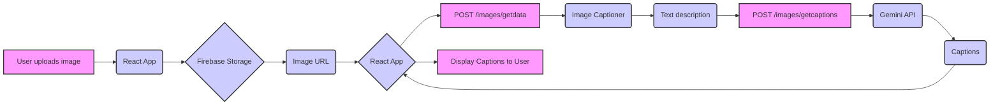
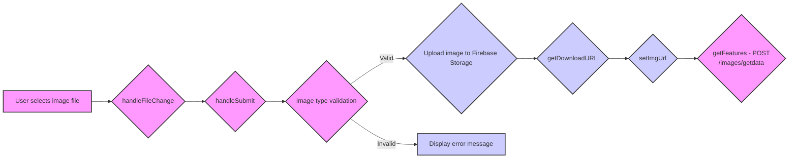
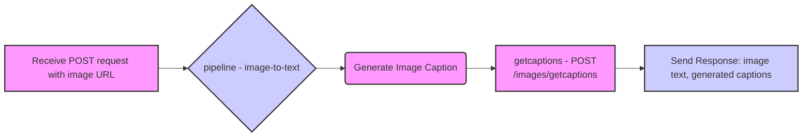
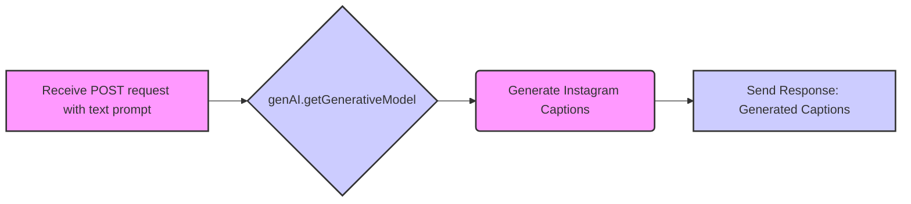
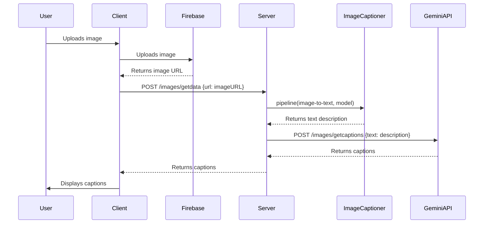

```markdown
# Project Documentation: Image Captioning and Caption Generation

## Overall Overview:

This project aims to generate captions for images using a combination of image-to-text models and a large language model. The architecture consists of a client-side React application (built with Vite), a server-side Express API (Node.js), and Firebase Storage for image hosting.

*   **Client-side:** Handles image upload, interacts with the server-side API, and displays the generated image captions.
*   **Server-side:** Uses image-to-text transformer model to generate textual representations of images, and then uses these representations to generate captions via the Google Gemini API.
*   **Firebase Storage:** Stores uploaded images and provides URLs for the server-side to process.

The different languages and modules interact as follows:

1.  The user uploads an image via the React client.
2.  The client uploads the image to Firebase Storage.
3.  Firebase Storage returns a URL for the uploaded image.
4.  The client sends a POST request to the server's `/images/getdata` endpoint with the image URL.
5.  The server uses the image-to-text model (`Xenova/vit-gpt2-image-captioning`) to generate a text description of the image.
6.  The server sends a POST request to the `/images/getcaptions` endpoint using the Google Gemini API with the description to generate Instagram captions.
7.  The server returns the generated captions to the client.
8.  The client displays the generated captions to the user.

## File/Module-Level Details:

### API (Server-Side):

*   **`api/index.js` (JavaScript):**
    *   Entry point for the server-side application.
    *   Sets up the Express server, defines middleware (CORS, JSON parsing), and mounts the image routes.
    *   Uses `dotenv` to load environment variables from a `.env` file.
    *   Listens on port 3000.
    *   Dependencies: `express`, `./routes/image.routes.js`, `dotenv`, `cors`.
*   **`api/routes/image.routes.js` (JavaScript):**
    *   Defines the routes for image-related functionality.
    *   Handles POST requests to `/getdata` and `/getcaptions`, mapping them to the corresponding controller functions.
    *   Uses `express.Router` to create modular route handlers.
    *   Dependencies: `express`, `../controllers/image.controllers.js`.
*   **`api/controllers/image.controllers.js` (JavaScript):**
    *   Contains the controller functions for handling image-related requests.
    *   `getdata`: Takes an image URL from the request body, uses the `Xenova/vit-gpt2-image-captioning` model to generate a text description of the image, and returns the output as a JSON response.
    *   `getcaptions`: Takes a text from the request body, uses the Google Gemini API to generate captions based on the text, and returns the captions as a JSON response.
    *   Dependencies: `@xenova/transformers`, `@google/generative-ai`.

### Client (Client-Side):

*   **`client/.eslintrc.cjs` (JavaScript):**
    *   ESLint configuration file for the client-side React application.
    *   Defines linting rules and settings for code style and potential errors.
*   **`client/README.md` (Markdown):**
    *   Basic README file generated by Vite, providing basic instructions for React + Vite project.
*   **`client/index.html` (HTML):**
    *   HTML entry point for the client-side application.
    *   Contains the root `div` where the React application is mounted.
*   **`client/package-lock.json` (JSON):**
    *   Records the exact versions of dependencies used in the client-side project.
*   **`client/package.json` (JSON):**
    *   Defines the client-side project's metadata, dependencies, and scripts.
    *   Dependencies: `react`, `react-dom`, `firebase`.
    *   DevDependencies: `@vitejs/plugin-react-swc`, `autoprefixer`, `eslint`, `eslint-plugin-react`, `eslint-plugin-react-hooks`, `eslint-plugin-react-refresh`, `postcss`, `tailwindcss`, `vite`, `@types/react`, `@types/react-dom`.
*   **`client/postcss.config.js` (JavaScript):**
    *   Configuration file for PostCSS, used for CSS transformations like autoprefixer and Tailwind CSS.
    *   Dependencies: `tailwindcss`, `autoprefixer`.
*   **`client/src/App.jsx` (JavaScript):**
    *   Main component of the React application.
    *   Handles image upload to Firebase Storage.
    *   Calls API endpoints to generate captions.
    *   Displays the image and generated captions.
    *   Dependencies: `react`, `./config.js`.
*   **`client/src/config.js` (JavaScript):**
    *   Configures Firebase and exports the storage object for image uploads.
    *   Dependencies: `firebase/app`, `firebase/storage`.
*   **`client/src/index.css` (CSS):**
    *   Global CSS file for the client-side application.
    *   Imports Tailwind CSS directives.
*   **`client/src/main.jsx` (JavaScript):**
    *   Entry point for the React application.
    *   Renders the `App` component into the root element.
*   **`client/tailwind.config.js` (JavaScript):**
    *   Configuration file for Tailwind CSS, defining styles and customization options.
*   **`client/vite.config.js` (JavaScript):**
    *   Configuration file for Vite, defining build settings and plugins.
    *   Dependencies: `@vitejs/plugin-react-swc`.
*   **`package.json` (JSON):**
        * Defines the dependencies and scripts.

### Utility:

*   **`postinstall.js` (JavaScript):**
    *   A script that is run after `npm install` or `yarn install` to pre-download the `image-to-text` model.

## Key Functions and Components:

*   **`getdata` (api/controllers/image.controllers.js):**
    *   Asynchronously generates a text description for the uploaded image using the Hugging Face Transformers library.
    *   This function initializes an `image-to-text` pipeline with the `"Xenova/vit-gpt2-image-captioning"` model.
    *   This text is passed to the Google Gemini API to generate relevant Instagram captions, facilitating user engagement and growth on their posts.
*   **`getcaptions` (api/controllers/image.controllers.js):**
    *   Asynchronously generates captions based on a given text prompt using the Google Gemini API.
    *   It constructs a prompt that asks for Instagram captions to grow engagement, tailored to the specific content described in the text.
*   **`App` (client/src/App.jsx):**
    *   Handles the core user interface, including image uploading to Firebase and fetching captions from the server.
    *   This component is a central hub for user interaction and data flow.
*   **Firebase Storage (client/src/config.js, client/src/App.jsx):**
    *    Enables uploading the image to the firebase storage.

## Implementation Details:

*   **Error Handling:**
    *   The API endpoints use `try...catch` blocks to handle potential errors during image processing and API calls. Errors are logged to the console, and appropriate error responses are sent to the client.
    *   The client-side application includes basic error handling for file uploads.
*   **File Structure Conventions:**
    *   The project follows a standard structure, separating client-side and server-side code into distinct directories (`client` and `api`).
    *   Within each directory, code is further organized by functionality (e.g., routes, controllers, components).
*   **Data Flows:**
    1.  Image is uploaded and stored on Firebase Storage.
    2.  The `getdata` function receives the image URL, generates a text description, and passes that to `getcaptions`.
    3.  The `getcaptions` function generates the social media captions.
    4.  The server returns the captions to the client for display.
*   **Environment Variables:**
    *   The server uses the `dotenv` package to load configuration settings, such as API keys, from environment variables.  The client accesses firebase api key from .env file.

## Visual Diagrams:

### End-to-End Data Flow



### Flowchart 1: Client-Side Image Upload and Processing



### Flowchart 2: API - /images/getdata Endpoint



### Flowchart 3: API - /images/getcaptions Endpoint



### Sequence Diagram: Image Caption Generation



There is no database design available.
```
