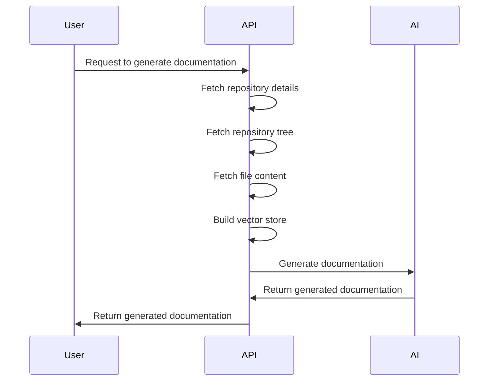

## 🎯 Overall Project Purpose
The project aims to analyze a multi-language codebase along with existing documentation to generate comprehensive documentation in Markdown format. It involves fetching code from various files, processing it, and creating structured documentation using AI-powered tools.

## 🧩 Module-Level Summaries
### `index.html`
- Purpose: Main HTML file for the project.
- Functionality: Defines the structure of the web page.
  
### `tailwind.config.js`
- Purpose: Configuration file for Tailwind CSS.
- Functionality: Defines theme settings and plugins for Tailwind CSS.

### `vite.config.js`
- Purpose: Vite configuration file.
- Functionality: Configures Vite settings for the project.

### `postcss.config.js`
- Purpose: PostCSS configuration file.
- Functionality: Configures PostCSS plugins for the project.

### `app.py`
- Purpose: Python script for generating comprehensive documentation.
- Functionality: Reads existing documentation and code, processes it, and generates Markdown documentation using AI.

### `activate_venv.py`
- Purpose: Python script for activating a virtual environment.
- Functionality: Activates the virtual environment for the project.

### `main.py`
- Purpose: FastAPI script for API endpoints.
- Functionality: Handles API requests for generating documentation and interacting with GitHub repositories.

### `index.css`
- Purpose: CSS file for styling the project.
- Functionality: Contains Tailwind CSS styles.

### `classNames.js`
- Purpose: Utility function for joining CSS class names.
- Functionality: Conditionally joins CSS class names together.

### `supabase.js`
- Purpose: Supabase client setup file.
- Functionality: Creates a Supabase client for interacting with Supabase services.

## 🧠 Code Logic and Workflows
The `app.py` script reads existing documentation and code, chunks it, and creates a prompt for generating comprehensive documentation using AI. The `main.py` script handles API requests, interacts with GitHub repositories, and generates documentation based on user input.

## 📊 Workflow Diagrams


## 🗂️ Architecture Diagram
The project architecture involves frontend (HTML, CSS), backend (Python scripts), API (FastAPI), and AI services for documentation generation.

## 🧬 Service/API Dependency Diagrams
```
graph TD;
    A[User] --> B[API]
    B --> C[GitHub API]
    B --> D[AI Service]
    B --> E[Supabase Service]
```

## 💡 Best Practices & Improvement Suggestions
- Implement error handling for API requests and AI service interactions.
- Enhance documentation generation logic for better accuracy.
- Consider modularizing code for better maintainability.
- Add unit tests for critical functionalities.
- Optimize code for performance and scalability.