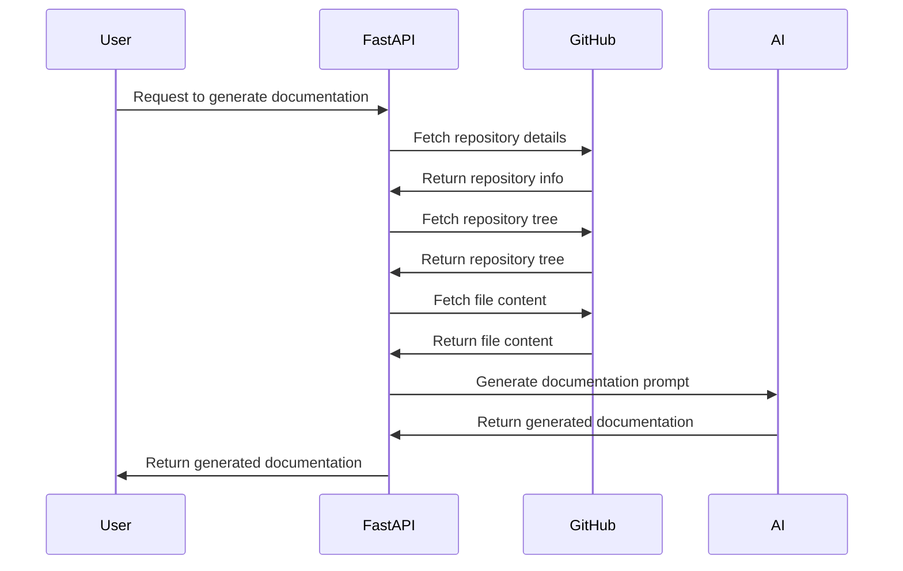

## 🎯 Overall Project Purpose
The project aims to analyze a multi-language codebase along with existing documentation to generate comprehensive documentation in Markdown format. It involves fetching code from various files, processing it, and utilizing AI models to generate detailed documentation.

## 🧩 Module-Level Summaries
1. **index.html**: Contains the HTML structure for the project's main page.
2. **tailwind.config.js**: Configures Tailwind CSS settings for the project.
3. **vite.config.js**: Configuration file for Vite, a frontend build tool.
4. **postcss.config.js**: Configures PostCSS plugins for processing CSS.
5. **app.py**: Python script to analyze codebase and generate documentation using AI.
6. **activate_venv.py**: Python script to activate a virtual environment.
7. **main.py**: FastAPI script for API endpoints and documentation generation.
8. **index.css**: CSS file for styling the project.
9. **classNames.js**: Utility function for joining CSS class names.
10. **supabase.js**: JavaScript file for interacting with Supabase database.

## 🧠 Code Logic and Workflows
- **app.py**: Reads existing documentation and code, chunks them, and generates a prompt for AI documentation generation using the `genai` library.
- **activate_venv.py**: Activates a virtual environment based on the OS.
- **main.py**: FastAPI script with endpoints to interact with GitHub repositories, fetch code, process it, generate documentation prompts, and utilize AI models for documentation generation.
- **supabase.js**: Interacts with Supabase database using `@supabase/supabase-js` client.

## 📊 Workflow Diagrams


## 🗂️ Architecture Diagram
```
project/
├── index.html
├── tailwind.config.js
├── vite.config.js
├── postcss.config.js
├── app.py
├── activate_venv.py
├── main.py
├── index.css
├── classNames.js
└── supabase.js
```

## 🧬 Service/API Dependency Diagrams
- **GitHub API**: Used to fetch repository details and content.
- **AI Service (genai)**: Utilized for generating comprehensive documentation.
- **Supabase Database**: Interacted with for database operations.

## 🛠️ Database ER Diagrams
```mermaid
erDiagram
    USER {
        string email
        string name
    }
    DOCUMENTATION {
        string title
        string content
    }
    USER ||--o{ DOCUMENTATION
```

## 💡 Best Practices & Improvement Suggestions
- **Best Practices**:
  - Use consistent coding styles and naming conventions.
  - Implement error handling for robustness.
  - Document code and functions for better understanding.
- **Improvement Suggestions**:
  - Implement unit tests for critical functions.
  - Enhance API documentation for clarity.
  - Optimize code for performance where necessary.