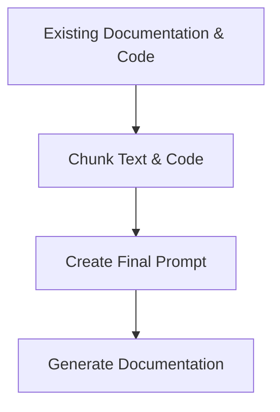

## 🎯 Overall Project Purpose
The project aims to analyze a multi-language codebase along with any existing documentation provided and generate comprehensive documentation formatted as a Markdown file. The output includes sections covering the project's goals, architectural structure, file/module-level details, key functions/components, implementation details, and visual diagrams.

## 🧩 Module-Level Summaries
### `index.html`
- Purpose: HTML file for the project's main page.
### `tailwind.config.js`
- Purpose: Configuration file for Tailwind CSS.
### `vite.config.js`
- Purpose: Configuration file for Vite.
### `postcss.config.js`
- Purpose: Configuration file for PostCSS.
### `app.py`
- Purpose: Python script for generating comprehensive documentation.
### `activate_venv.py`
- Purpose: Python script for activating a virtual environment.
### `main.py`
- Purpose: FastAPI script for generating documentation from a GitHub repository.
### `index.css`
- Purpose: CSS file for styling.
### `classNames.js`
- Purpose: Utility function for joining CSS class names.
### `supabase.js`
- Purpose: JavaScript file for interacting with Supabase.

## 🧠 Code Logic and Workflows
The `app.py` script reads existing documentation and code files, chunks them, creates a prompt, and generates comprehensive documentation using the Gemini API. The `main.py` script uses FastAPI to interact with GitHub repositories, fetch file contents, build vector stores, and generate documentation based on user input.

## 📊 Workflow Diagrams


## 🗂️ Architecture Diagram
```
index.html
tailwind.config.js
vite.config.js
postcss.config.js
app.py
activate_venv.py
main.py
index.css
classNames.js
supabase.js
```

## 🧬 Service/API Dependency Diagrams
No specific service or API dependency diagrams found in the codebase.

## 🛠️ Database ER Diagrams
No database ER diagrams found in the codebase.

## 💡 Best Practices & Improvement Suggestions
- Implement database ER diagrams to visualize data structures.
- Enhance code comments and documentation for better understanding.
- Consider adding more detailed workflow diagrams for complex processes.