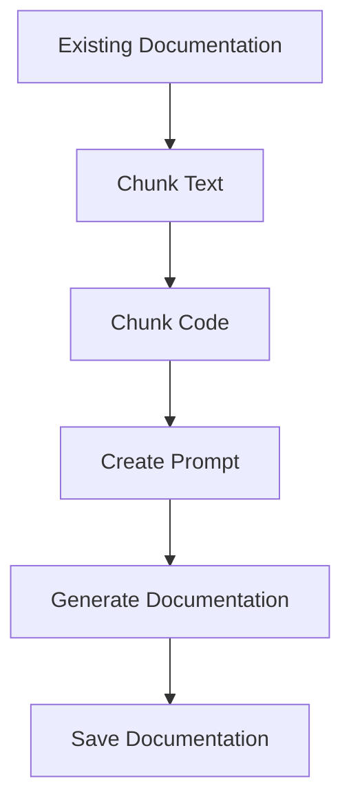

## 🎯 Overall Project Purpose
The project aims to analyze a multi-language codebase along with existing documentation to generate comprehensive documentation formatted as a Markdown file. It involves fetching code from various files, processing it, and creating structured documentation.

## 🧩 Module-Level Summaries
### `index.html`
- Purpose: Main HTML file for the project.
- Functionality: Defines the basic structure of the web page.
### `tailwind.config.js`
- Purpose: Configuration file for Tailwind CSS.
- Functionality: Defines theme settings and plugins for Tailwind CSS.
### `vite.config.js`
- Purpose: Configuration file for Vite.
- Functionality: Configures Vite plugins for the project.
### `postcss.config.js`
- Purpose: Configuration file for PostCSS.
- Functionality: Configures PostCSS plugins for the project.
### `app.py`
- Purpose: Python script for generating comprehensive documentation.
- Functionality: Reads code files, chunks text and code, generates documentation using AI, and saves it.
### `activate_venv.py`
- Purpose: Python script to activate a virtual environment.
- Functionality: Activates the virtual environment in Windows systems.
### `main.py`
- Purpose: FastAPI script for interacting with GitHub repositories.
- Functionality: Fetches repository details, builds vector stores, and generates documentation.
### `index.css`
- Purpose: CSS file for styling the project.
- Functionality: Contains Tailwind CSS directives for styling.
### `classNames.js`
- Purpose: JavaScript utility for joining CSS class names.
- Functionality: Conditionally joins CSS class names together.
### `supabase.js`
- Purpose: JavaScript file for interacting with Supabase.
- Functionality: Creates a Supabase client for database operations.

## 🧠 Code Logic and Workflows
The `app.py` script reads existing documentation and code, chunks them, creates a prompt, generates documentation using AI, and saves it. The `main.py` script interacts with GitHub repositories, fetches code, builds vector stores, and generates documentation based on user input.

## 📊 Workflow Diagrams


## 🗂️ Architecture Diagram
```
index.html
|__ tailwind.config.js
|__ vite.config.js
|__ postcss.config.js
|__ app.py
|__ activate_venv.py
|__ main.py
|__ index.css
|__ classNames.js
|__ supabase.js
```

## 🧬 Service/API Dependency Diagrams
- `app.py` depends on the `genai` library for AI content generation.
- `main.py` interacts with GitHub API for repository details.

## 🛠️ Database ER Diagrams
- No schema or ORM found in the provided codebase.

## 💡 Best Practices & Improvement Suggestions
- Implement error handling for API calls and file operations.
- Use environment variables for sensitive data like API keys.
- Add unit tests to ensure code reliability.
- Document code functions and classes for better understanding.
- Consider modularizing code for improved maintainability.