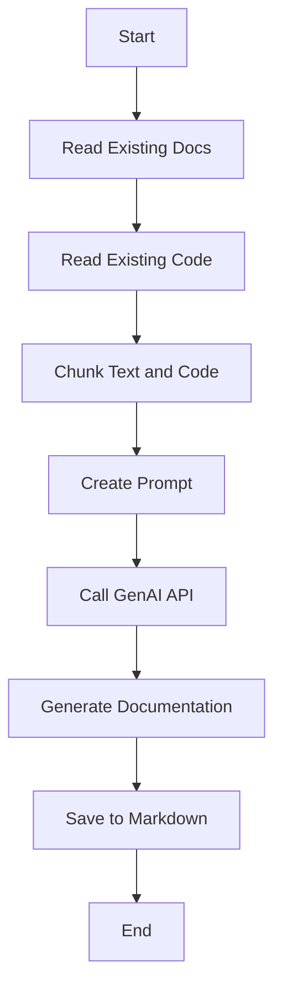
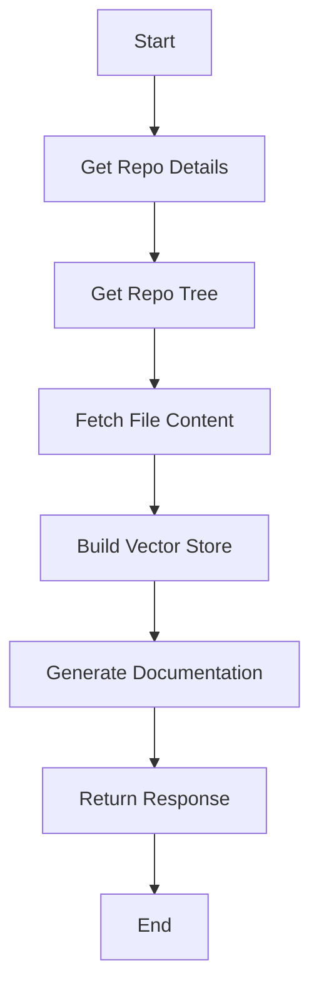
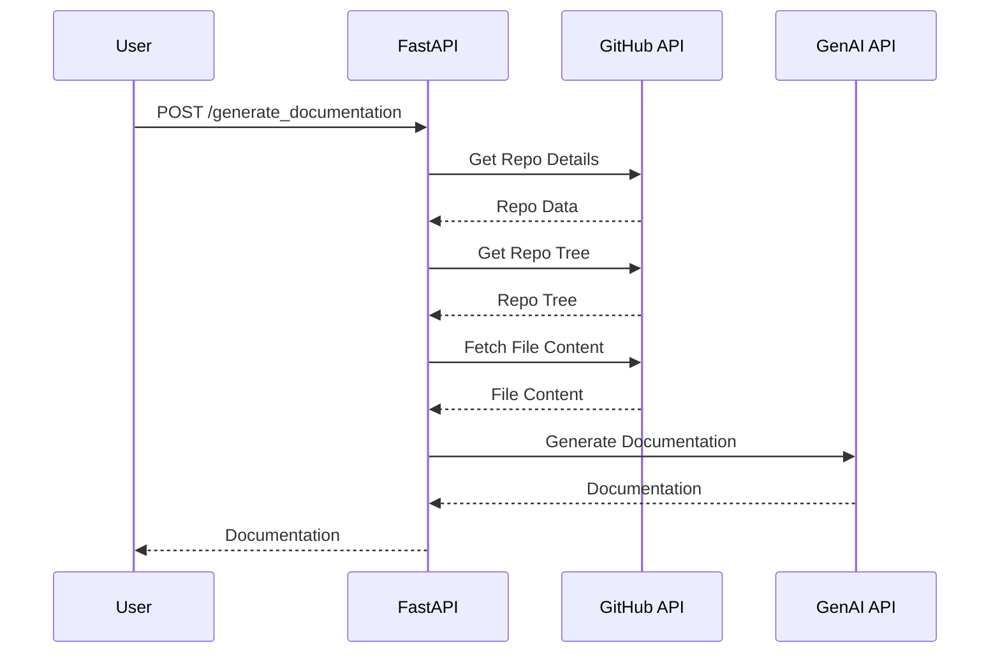

# Comprehensive Documentation for @ai-docs

## 🎯 Overall Project Purpose

The `@ai-docs` project is designed to automate the generation of comprehensive documentation for codebases. It leverages AI models to analyze multi-language codebases and existing documentation to produce Markdown-formatted documentation. This tool is particularly useful for developers and teams who need to maintain up-to-date documentation for their projects, ensuring consistency and thoroughness across various components and languages.

## 🧩 Module-Level Summaries

### HTML and Configuration Files

- **`index.html`**: Serves as the entry point for the web application, linking to the main JavaScript module and including necessary stylesheets.
- **`tailwind.config.js`**: Configures Tailwind CSS, specifying content paths and extending the default theme with custom animations and fonts.
- **`vite.config.js`**: Configures Vite, a build tool optimized for front-end development, with React support.
- **`postcss.config.js`**: Sets up PostCSS with plugins for Tailwind CSS and Autoprefixer.

### Python Scripts

- **`app.py`**: Handles the generation of documentation by reading existing code and documentation, chunking them, and using the Google GenAI API to produce the final documentation.
- **`activate_venv.py`**: A utility script to activate a Python virtual environment, specifically designed for Windows systems.
- **`main.py`**: Implements a FastAPI server that provides an API endpoint for generating documentation from a GitHub repository. It manages user knowledge bases and vector stores for efficient data retrieval.

### JavaScript Files

- **`classNames.js`**: Provides a utility function to conditionally join CSS class names.
- **`supabase.js`**: Initializes a Supabase client for interacting with a Supabase backend.

### CSS File

- **`index.css`**: Imports Tailwind CSS base, components, and utilities.

## 🧠 Code Logic and Workflows

### Documentation Generation Workflow

1. **Initialization**: The `app.py` script initializes by reading existing documentation and code files, chunking them for processing.
2. **Prompt Creation**: It creates a prompt for the AI model by combining code and documentation chunks with a base prompt template.
3. **AI Processing**: The Google GenAI API is called to generate documentation based on the provided prompt.
4. **Output**: The generated documentation is saved to a Markdown file.

### API Workflow

1. **Repository Details**: The `main.py` script fetches repository details using the GitHub API.
2. **File Retrieval**: It retrieves file contents from the repository, excluding certain directories and files.
3. **Vector Store Creation**: Builds a vector store for the user's knowledge base using sentence embeddings.
4. **Documentation Generation**: Calls the AI model to generate documentation and returns the result.

## 📊 Workflow Diagrams

### Documentation Generation Flow



### API Interaction Flow



## 🗂️ Architecture Diagram

```mermaid
graph TD
    A[index.html] -->|Links| B[/src/main.jsx]
    B --> C[tailwind.config.js]
    B --> D[vite.config.js]
    B --> E[postcss.config.js]
    B --> F[app.py]
    B --> G[activate_venv.py]
    B --> H[main.py]
    B --> I[classNames.js]
    B --> J[supabase.js]
    B --> K[index.css]
```

## 🧬 Service/API Dependency Diagrams

### API and External Service Interaction



## 🛠️ Best Practices & Improvement Suggestions

- **Error Handling**: Improve error handling by adding more specific exception types and logging for better traceability.
- **Environment Configuration**: Ensure environment variables are securely managed and documented for deployment.
- **Scalability**: Consider optimizing the vector store for larger datasets and multiple concurrent users.
- **Cross-Platform Support**: Enhance the `activate_venv.py` script to support Unix-like systems for broader usability.
- **Security**: Review API keys and tokens management to prevent unauthorized access and leaks.
- **Testing**: Implement unit and integration tests to ensure the reliability of API endpoints and utility functions.

This documentation provides a comprehensive overview of the `@ai-docs` project, detailing its purpose, structure, and workflows, along with suggestions for improvement.