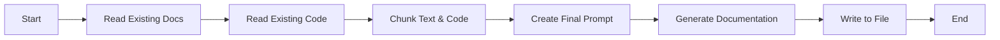
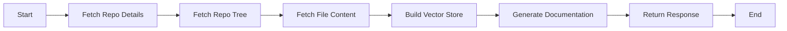
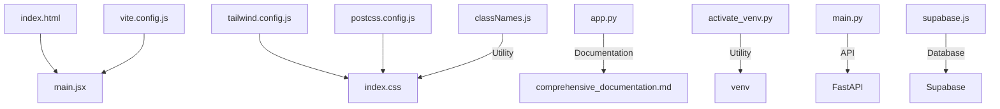

# Comprehensive Documentation for @ai-docs

## 🎯 Overall Project Purpose

The `@ai-docs` project is designed to automate the generation of comprehensive documentation for multi-language codebases. It leverages AI models to analyze code and existing documentation, producing Markdown-formatted documentation that includes architectural overviews, module details, key functions, and visual diagrams. This tool is particularly useful for developers and teams looking to maintain up-to-date documentation with minimal manual effort.

## 🧩 Module-Level Summaries

### HTML and Configuration Files

- **`index.html`**: The entry point for the web application, linking to the main JavaScript module and including necessary metadata and stylesheets.
- **`tailwind.config.js`**: Configuration file for Tailwind CSS, specifying content paths and extending the default theme with custom animations and fonts.
- **`vite.config.js`**: Configuration for Vite, a build tool optimized for frontend development, with React plugin integration.
- **`postcss.config.js`**: Configures PostCSS with Tailwind CSS and Autoprefixer plugins for processing CSS.

### Python Scripts

- **`app.py`**: A script for generating documentation using the Google GenAI API. It reads existing documentation and code, chunks them, and creates a prompt for the AI model to generate the final documentation.
- **`activate_venv.py`**: A utility script to activate a Python virtual environment on Windows systems.
- **`main.py`**: A FastAPI application that provides an API endpoint for generating documentation from a GitHub repository. It uses sentence embeddings and FAISS for vector storage and retrieval.

### JavaScript Files

- **`classNames.js`**: A utility function for conditionally joining CSS class names.
- **`supabase.js`**: Initializes a Supabase client for interacting with a Supabase backend.

### CSS

- **`index.css`**: Imports Tailwind CSS base, components, and utilities for styling the application.

## 🧠 Code Logic and Workflows

### Documentation Generation Workflow

1. **Read Existing Documentation**: `get_existing_docs()` reads any existing documentation from `demo.md`.
2. **Read Existing Code**: `get_existing_code()` traverses the project directory, reading code files and excluding certain directories and files.
3. **Chunking**: `chunk_text()` and `chunk_code()` split the documentation and code into manageable chunks.
4. **Prompt Creation**: `create_final_prompt()` combines chunks into a prompt for the AI model.
5. **AI Documentation Generation**: `generate_documentation()` sends the prompt to the Google GenAI API and writes the response to `comprehensive_documentation.md`.

### API Workflow

1. **Fetch Repository Details**: `get_repo_details()` extracts owner, repo, and branch information from a GitHub URL.
2. **Fetch Repository Tree**: `get_repo_tree()` retrieves the file tree of the repository.
3. **Fetch File Content**: `fetch_file_content()` downloads the content of each file.
4. **Build Vector Store**: `build_vector_store()` encodes file chunks into vectors and stores them in a FAISS index.
5. **Generate Documentation**: `/generate_documentation` endpoint processes the repository and generates documentation using the AI model.

## 📊 Workflow Diagrams

### Documentation Generation Flow



### API Workflow



## 🗂️ Architecture Diagram



## 🧬 Service/API Dependency Diagrams

```mermaid
graph TD;
    main.py -->|API Call| GitHub;
    main.py -->|API Call| Google GenAI;
    main.py -->|Database| Supabase;
```

## 💡 Best Practices & Improvement Suggestions

- **Error Handling**: Enhance error handling in API calls and file operations to provide more informative messages and fallback mechanisms.
- **Security**: Secure API keys and tokens by using environment variables and ensure they are not exposed in logs.
- **Scalability**: Consider implementing caching mechanisms for frequently accessed data to improve performance.
- **Testing**: Add unit and integration tests to ensure the reliability and correctness of the documentation generation process.
- **Documentation**: Include inline comments and docstrings for all functions and classes to improve code readability and maintainability.

This documentation provides a comprehensive overview of the `@ai-docs` project, detailing its purpose, structure, and workflows. It serves as a guide for developers to understand and contribute to the project effectively.