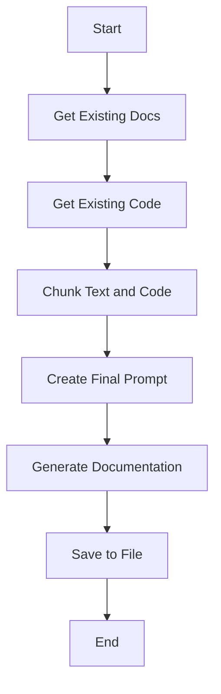
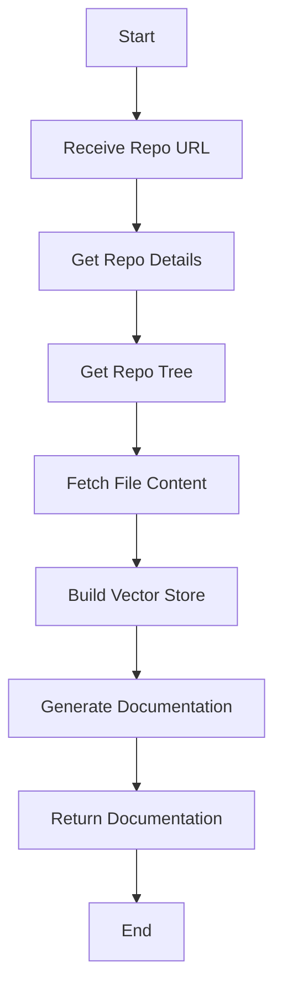
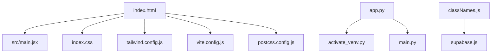
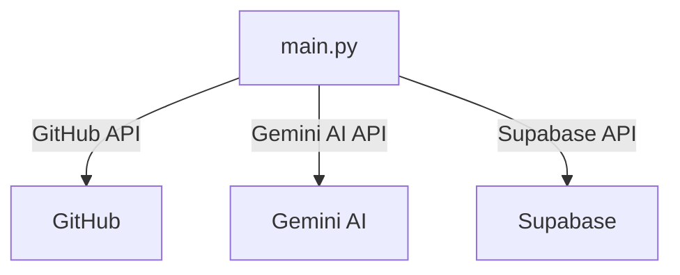

# Project Documentation: AI-Docs

## 🎯 Overall Project Purpose

The AI-Docs project is designed to automate the generation of comprehensive documentation for multi-language codebases. It leverages AI models to analyze existing code and documentation, producing markdown files that provide detailed insights into the project's structure, functionality, and workflows. This tool is particularly useful for developers and teams looking to maintain up-to-date documentation without manual effort, thereby enhancing codebase understanding and collaboration.

## 🧩 Module-Level Summaries

### HTML and CSS

- **index.html**: The entry point for the web application. It sets up the basic HTML structure and links to the main JavaScript module and stylesheets.
- **index.css**: Utilizes Tailwind CSS for styling, importing base, components, and utilities.

### Configuration Files

- **tailwind.config.js**: Configures Tailwind CSS, specifying content paths and extending the theme with custom animations and fonts.
- **vite.config.js**: Configures Vite, a build tool that enhances the development experience for React applications.
- **postcss.config.js**: Configures PostCSS with plugins for Tailwind CSS and Autoprefixer.

### Python Scripts

- **app.py**: Handles the generation of documentation by reading code files, chunking text, and interacting with the Gemini AI model to produce markdown documentation.
- **activate_venv.py**: A utility script for activating a Python virtual environment on Windows systems.

### FastAPI Application

- **main.py**: Implements a FastAPI application that provides an API endpoint for generating documentation. It handles GitHub repository interactions, content fetching, and vector store management for user-specific knowledge bases.

### JavaScript Utilities

- **classNames.js**: Provides a utility function to conditionally join CSS class names.
- **supabase.js**: Sets up a Supabase client for database interactions using environment variables for configuration.

## 🧠 Code Logic and Workflows

### Python Workflow

1. **Documentation Generation**: 
   - `app.py` reads existing documentation and code files, chunks them, and creates a prompt for the Gemini AI model.
   - The AI model generates markdown documentation, which is saved to a file.

2. **FastAPI Service**:
   - `main.py` provides an endpoint to generate documentation for a given GitHub repository URL.
   - It fetches repository details, retrieves file contents, and builds a vector store for efficient content retrieval.
   - The documentation is generated using the Gemini AI model and returned to the user.

### JavaScript Workflow

1. **Frontend Setup**:
   - `index.html` initializes the application by linking to the main React module (`main.jsx`) and stylesheets.
   - `classNames.js` and `supabase.js` provide utility functions for CSS class management and database interactions, respectively.

## 📊 Workflow Diagrams

### Python Documentation Generation

### FastAPI Endpoint Workflow

## 🗂️ Architecture Diagram

## 🧬 Service/API Dependency Diagrams

## 🛠️ Database ER Diagram

No explicit database schema or ORM was found in the provided codebase. The project uses Supabase, which suggests a potential for database interactions, but the schema is not defined in the code.

## 💡 Best Practices & Improvement Suggestions

1. **Error Handling**: Enhance error handling in API interactions, particularly with external services like GitHub and Gemini AI, to provide more informative error messages and fallback mechanisms.

2. **Environment Configuration**: Ensure all sensitive information, such as API keys, is securely managed using environment variables and not hardcoded in the source code.

3. **Documentation**: While the project generates documentation, maintaining a high-level overview and developer guide within the repository would improve onboarding and usage understanding.

4. **Testing**: Implement unit and integration tests for critical components, especially the FastAPI endpoints and AI interaction logic, to ensure reliability and robustness.

5. **Scalability**: Consider optimizing the vector store management for large repositories to handle increased data efficiently, possibly by leveraging more advanced indexing techniques or distributed storage solutions.