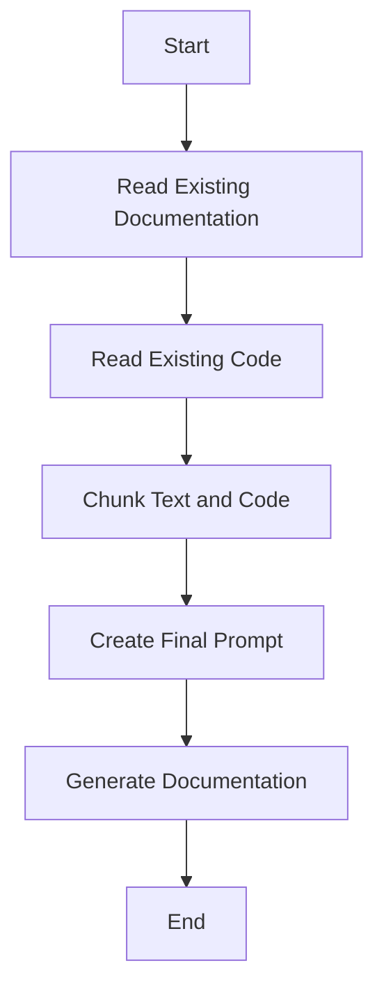
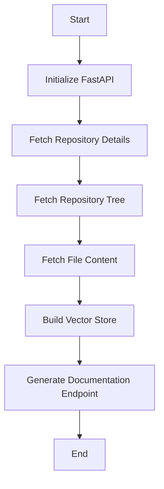
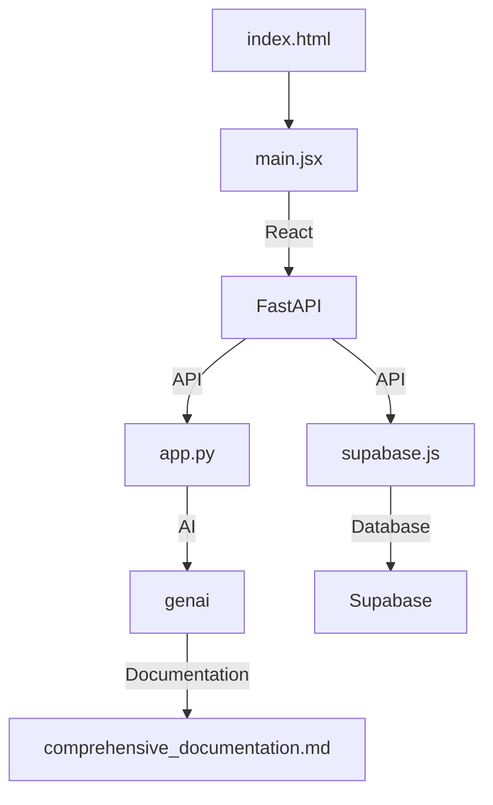
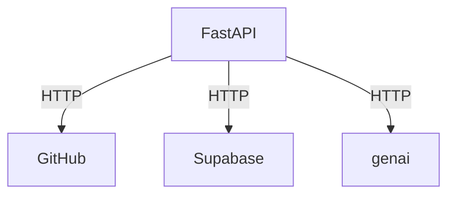

# Comprehensive Documentation for @ai-docs Project

## 🎯 Overall Project Purpose

The `@ai-docs` project aims to automate the generation of comprehensive documentation for multi-language codebases. It leverages AI models to analyze code and existing documentation, producing Markdown-formatted documentation that includes architectural overviews, file/module-level details, key functions, implementation specifics, and visual diagrams. This project addresses the problem of manual documentation, which can be time-consuming and error-prone, by providing a streamlined, automated solution.

## 🧩 Module-Level Summaries

### index.html
- **Purpose**: Serves as the entry point for the web application.
- **Functionality**: Loads fonts and initializes the React application by linking to `main.jsx`.

### tailwind.config.js
- **Purpose**: Configuration file for Tailwind CSS.
- **Functionality**: Specifies the content sources for Tailwind to scan for class names and customizes the theme with additional animations and fonts.

### vite.config.js
- **Purpose**: Configuration file for Vite.
- **Functionality**: Sets up Vite with React plugin for building the application.

### postcss.config.js
- **Purpose**: Configuration for PostCSS.
- **Functionality**: Integrates Tailwind CSS and Autoprefixer for processing CSS files.

### app.py
- **Purpose**: Script to generate documentation using AI.
- **Functionality**: Reads existing documentation and code, chunks them, and generates a final prompt for the AI model to produce documentation.

### activate_venv.py
- **Purpose**: Script to activate a Python virtual environment.
- **Functionality**: Activates the virtual environment on Windows systems.

### main.py
- **Purpose**: Main backend application using FastAPI.
- **Functionality**: Provides API endpoints for generating documentation and managing user knowledge bases.

### index.css
- **Purpose**: Main CSS file for the application.
- **Functionality**: Imports base, components, and utilities from Tailwind CSS.

### classNames.js
- **Purpose**: Utility function for managing CSS class names.
- **Functionality**: Joins multiple CSS class names into a single string.

### supabase.js
- **Purpose**: Initializes Supabase client.
- **Functionality**: Connects to Supabase using environment variables for URL and anon key.

## 🧠 Code Logic and Workflows

### app.py Workflow
1. **Read Existing Documentation**: Attempts to read `demo.md` for existing documentation.
2. **Read Existing Code**: Walks through the project directory to read code files, excluding certain directories and files.
3. **Chunk Text and Code**: Splits the documentation and code into manageable chunks.
4. **Create Final Prompt**: Combines the chunks into a prompt for the AI model.
5. **Generate Documentation**: Uses the AI model to generate documentation based on the prompt.

### main.py Workflow
1. **Initialize FastAPI**: Sets up CORS middleware and initializes the application.
2. **Fetch Repository Details**: Extracts owner, repo, and branch from GitHub URL.
3. **Fetch Repository Tree**: Retrieves the file tree of the repository.
4. **Fetch File Content**: Downloads content of each file in the repository.
5. **Build Vector Store**: Encodes file chunks into embeddings and stores them in a FAISS index.
6. **Generate Documentation Endpoint**: API endpoint to generate documentation for a given repository URL.

## 📊 Workflow Diagrams

### app.py Workflow Diagram

### main.py Workflow Diagram

## 🗂️ Architecture Diagram

## 🧬 Service/API Dependency Diagrams

## 🛠️ Database ER Diagrams

No explicit database schema or ORM was found in the codebase.

## 💡 Best Practices & Improvement Suggestions

1. **Environment Variables**: Ensure sensitive information like API keys are securely managed using environment variables.
2. **Error Handling**: Implement comprehensive error handling, especially for network requests and file operations.
3. **Documentation**: Maintain up-to-date inline comments and module-level documentation to aid future developers.
4. **Testing**: Implement unit and integration tests to ensure the reliability of the application.
5. **Scalability**: Consider optimizing the chunking and vector storage process for handling large repositories efficiently.

This documentation provides a comprehensive overview of the `@ai-docs` project, detailing its components, workflows, and potential areas for improvement.