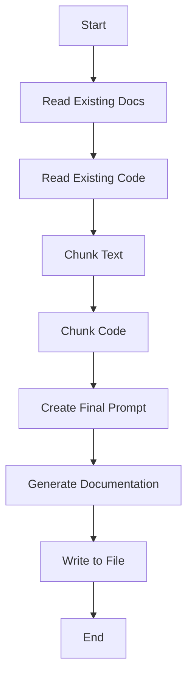
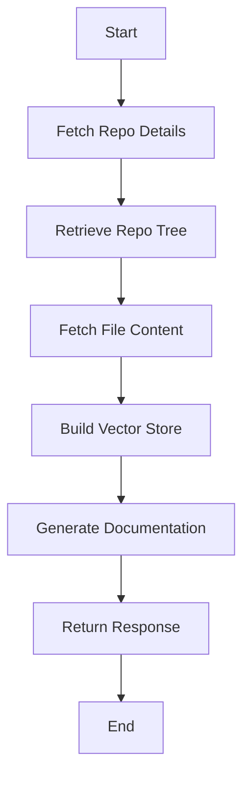
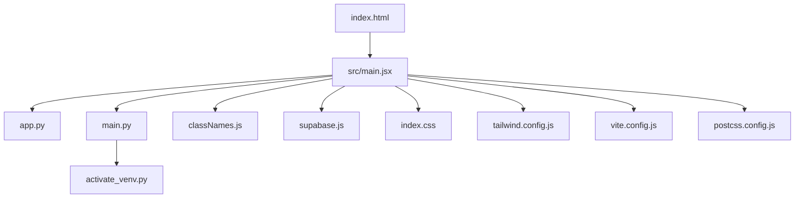
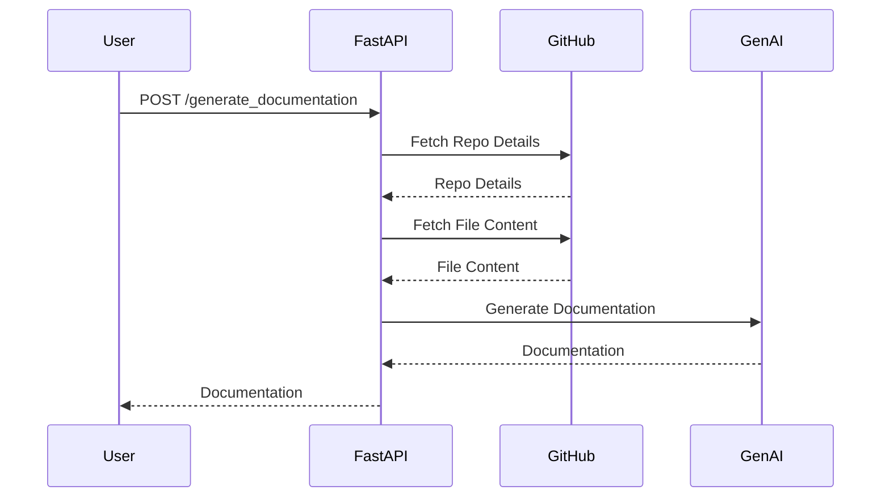

# Comprehensive Documentation for AI-Docs Project

## 🎯 Overall Project Purpose

The **AI-Docs** project is designed to automate the generation of comprehensive documentation for codebases using AI. It leverages the capabilities of Google's GenAI to analyze multi-language codebases and generate Markdown documentation. This project aims to simplify the documentation process, ensuring that developers can maintain up-to-date and detailed documentation with minimal manual effort.

## 🧩 Module-Level Summaries

### HTML and Configuration Files

- **`index.html`**: The entry point for the web application, linking necessary styles and scripts.
- **`tailwind.config.js`**: Configures Tailwind CSS, specifying content sources and extending themes with custom animations and fonts.
- **`vite.config.js`**: Configures Vite for the project, enabling React support through plugins.
- **`postcss.config.js`**: Configures PostCSS to use Tailwind CSS and Autoprefixer for CSS processing.

### Python Scripts

- **`app.py`**: Handles the generation of documentation by reading existing code and documentation, chunking text, and interacting with the GenAI API to produce the final Markdown documentation.
- **`activate_venv.py`**: A utility script to activate a Python virtual environment on Windows systems.
- **`main.py`**: Implements a FastAPI server that provides endpoints for generating documentation from a GitHub repository. It includes functions for fetching repository details, retrieving file contents, and building a vector store for embeddings.

### JavaScript Files

- **`index.css`**: Utilizes Tailwind CSS for styling the web application.
- **`classNames.js`**: A utility function to conditionally join CSS class names.
- **`supabase.js`**: Initializes a Supabase client for potential database interactions.

## 🧠 Code Logic and Workflows

### Documentation Generation Workflow

1. **Read Existing Documentation**: `get_existing_docs()` attempts to read existing documentation from `demo.md`.
2. **Read Existing Code**: `get_existing_code()` traverses the project directory, reading code files and excluding certain directories and files.
3. **Chunking**: `chunk_text()` and `chunk_code()` split the documentation and code into manageable chunks for processing.
4. **Prompt Creation**: `create_final_prompt()` combines the documentation and code chunks with a base prompt for GenAI.
5. **Generate Documentation**: `generate_documentation()` sends the prompt to GenAI and writes the generated documentation to `comprehensive_documentation.md`.

### FastAPI Workflow

1. **Fetch Repository Details**: `get_repo_details()` extracts owner, repo name, and default branch from a GitHub URL.
2. **Retrieve Repository Tree**: `get_repo_tree()` fetches the file tree of the repository.
3. **Fetch File Content**: `fetch_file_content()` retrieves the content of each file in the repository.
4. **Build Vector Store**: `build_vector_store()` creates a vector store using SentenceTransformer and FAISS for efficient text retrieval.
5. **Generate Documentation Endpoint**: `/generate_documentation` endpoint processes the repository and generates documentation using GenAI.

## 📊 Workflow Diagrams

### Documentation Generation Flow

### FastAPI Endpoint Flow

## 🗂️ Architecture Diagram

## 🧬 Service/API Dependency Diagrams

### API and Service Interactions

## 💡 Best Practices & Improvement Suggestions

- **Error Handling**: Improve error handling by implementing more specific exceptions and logging mechanisms.
- **Environment Configuration**: Use environment variables for sensitive data like API keys and tokens. Ensure `.env` files are not included in version control.
- **Code Modularity**: Consider breaking down large functions into smaller, more manageable ones for better readability and maintainability.
- **Testing**: Implement unit and integration tests to ensure the reliability of the documentation generation process.
- **Scalability**: Explore caching mechanisms for frequently accessed data to improve performance, especially when dealing with large repositories.

This documentation provides a comprehensive overview of the AI-Docs project, detailing its purpose, structure, and workflows. By following the suggested improvements, the project can enhance its robustness and maintainability.