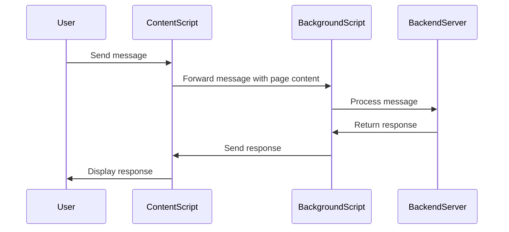
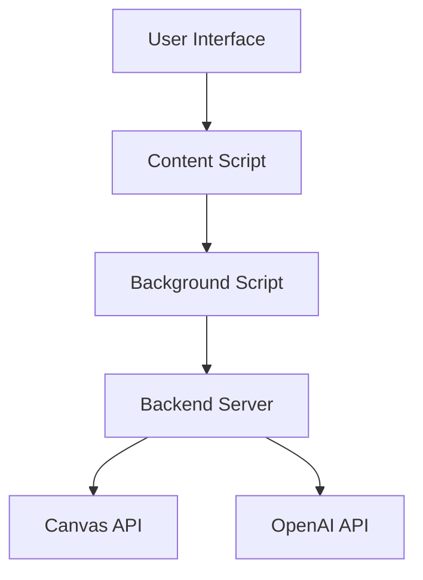
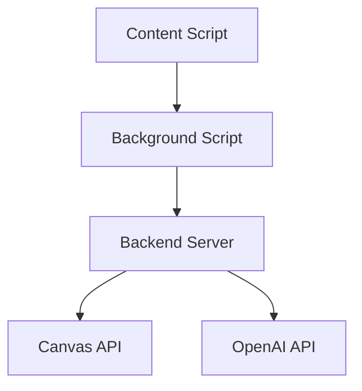

# Canvas AI Assistant Documentation

## 🎯 Project Purpose

The **Canvas AI Assistant** is designed to enhance the learning experience for students using the Canvas Learning Management System (LMS). It provides intelligent assistance by integrating AI capabilities to help students interact with course content more effectively. The assistant can generate quizzes, create slides, summarize content, and provide answers to questions about course materials, thereby making study sessions more efficient and engaging.

## 🧩 Module-Level Summaries

### `new_content.js`
- **Purpose**: Manages the content script for the Canvas AI Assistant. It handles the user interface elements, captures page content, and interacts with the background script to process user queries.
- **Key Functions**:
  - `getCurrentPageContent()`: Extracts and returns the current page's content, including URL, title, and specific content based on page type.
  - `createChatInterface()`: Initializes the chat interface on the Canvas page.
  - `sendMessage()`: Sends user messages to the background script for processing.
  - `fetchCanvasFiles()`: Fetches files from the Canvas API for the current course.

### `new_background.js`
- **Purpose**: Acts as the background script for the Chrome extension, handling messages from the content script and interacting with the backend server.
- **Key Functions**:
  - `processMessageWithContext(data)`: Processes messages with context from the page content and interacts with the backend server to get responses.
  - `editSelectedText`: Handles requests to edit selected text using the OpenAI API.

### `canvas_api.py`
- **Purpose**: Provides functions to interact with the Canvas API, such as listing and downloading files.
- **Key Functions**:
  - `list_files(course_id, token)`: Lists files available in a specified Canvas course.
  - `download_file(file_obj, token)`: Downloads a specified file from Canvas.

### `app.py`
- **Purpose**: Implements the Flask backend server that handles API requests from the Chrome extension and interacts with the OpenAI API for generating content.
- **Key Functions**:
  - `chat()`: Handles chat requests and generates responses or content (quizzes, slides) based on user input.
  - `get_canvas_files()`: API endpoint to retrieve files from a Canvas course.
  - `use_file_content()`: Processes file content to generate responses or slides.

### `background.js`
- **Purpose**: Another background script for handling messages and API requests, similar to `new_background.js`.
- **Key Functions**:
  - `processMessageWithContext(data)`: Similar to the function in `new_background.js`, processes messages and interacts with the backend.

### `content.js`
- **Purpose**: Another content script for managing the UI and interactions on the Canvas page, similar to `new_content.js`.
- **Key Functions**:
  - `getCurrentPageContent()`: Similar to the function in `new_content.js`, extracts page content.
  - `createChatInterface()`: Initializes the chat interface on the Canvas page.

## 🧠 Code Logic and Workflows

1. **Content Extraction**: The content scripts (`new_content.js` and `content.js`) extract the current page's content and determine the page type (syllabus, module, assignment, discussion) to gather specific content details.

2. **User Interaction**: The chat interface is created and displayed on the Canvas page, allowing users to interact with the AI assistant. Users can send messages, select files, and request content generation (quizzes, slides).

3. **Message Processing**: User messages are sent to the background scripts (`new_background.js` and `background.js`), which process the messages with context from the page content and interact with the backend server.

4. **Backend Interaction**: The Flask server (`app.py`) handles API requests from the background scripts, processes content using the OpenAI API, and returns responses or generated content (quizzes, slides).

5. **File Handling**: The `canvas_api.py` module provides functions to list and download files from Canvas, which are used by the backend server to process file content.

## 📊 Workflow Diagrams

### Message Processing Workflow

## 🗂️ Architecture Diagram

## 🧬 Service/API Dependency Diagrams

### Service Interaction

## 💡 Best Practices & Improvement Suggestions

1. **Security**: Ensure API keys and tokens are securely stored and not hardcoded in the scripts. Consider using environment variables or secure storage.

2. **Error Handling**: Improve error handling in API requests to provide more informative feedback to users in case of failures.

3. **Code Modularity**: Consider refactoring the code to improve modularity and separation of concerns, especially in the content and background scripts.

4. **User Experience**: Enhance the chat interface with more interactive elements and feedback to improve user engagement.

5. **Testing**: Implement comprehensive testing for both the frontend and backend components to ensure reliability and robustness.

This documentation provides a comprehensive overview of the Canvas AI Assistant project, detailing its purpose, structure, and workflows. The diagrams and suggestions aim to enhance understanding and guide future improvements.